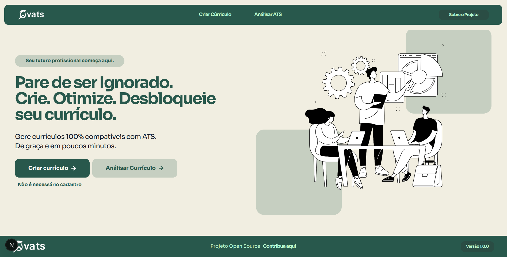

# cvats

Criador de currículos compatíveis com ATS (Applicant Tracking Systems). Simples, gratuito e focado em legibilidade por sistemas de triagem.

## Visão geral

O cvats ajuda você a montar currículos limpos, sem ruídos, com estrutura e tipografia amigáveis aos parsers de ATS, além de exportação em PDF.

## Proposta

- Tornar rápido e acessível criar um currículo compatível com ATS
- Interface simples, sem cadastro obrigatório
- Exportação em PDF com qualidade e foco em leitura automática

## Que problema resolve

Muitos currículos visualmente bonitos são rejeitados por ATS devido a elementos que dificultam a leitura automática. O cvats prioriza:

- Estrutura semântica clara por seções (Perfil, Experiências, Educação, Projetos, Habilidades)
- Layout e tipografia que favorecem parsers
- Conteúdo previsível para reduzir erros de extração

## Tecnologias utilizadas

- Next.js 16 + React 19
- TypeScript
- Tailwind CSS
- @react-pdf/renderer (renderização do PDF)

## Como contribuir

1. Abra uma issue curta descrevendo problema/ideia
2. Fork do repositório e branch a partir de `main`
3. Faça sua alteração objetiva e abra um PR explicando em 1–3 frases

Consulte `CONTRIBUTING.md` e `CODE_OF_CONDUCT.md` para detalhes rápidos.

## Como rodar o projeto localmente

Pré-requisitos: Node 18+ e pnpm (ou npm/yarn).

```bash
pnpm install
pnpm dev
# abra http://localhost:3000
```

Scripts úteis:

```bash
pnpm build   # build de produção
pnpm start   # inicia servidor de produção após o build
pnpm lint    # checa lint
```
## 💪 Contribuidores

Obrigado a todos que contribuíram 💖

<!-- ALL-CONTRIBUTORS-LIST:START - Do not remove or modify this section -->
<!-- prettier-ignore-start -->
<!-- markdownlint-disable -->
<table>
  <tr>
    <td align="center"><a href="https://github.com/renato"><br /><sub><b>Renato</b></sub></a></td>
  </tr>
</table>
<!-- markdownlint-restore -->
<!-- prettier-ignore-end -->
<!-- ALL-CONTRIBUTORS-LIST:END -->

## Licença

AGPL-3.0 — veja `LICENSE`.


