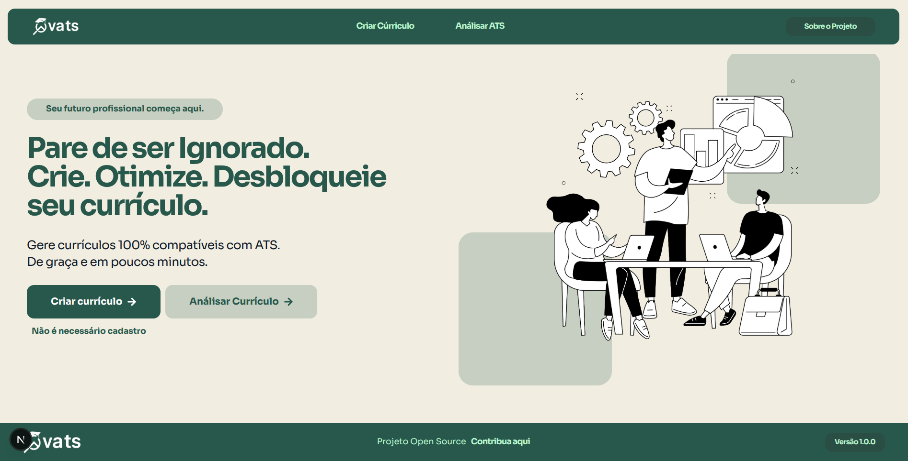

# cvats

Criador de currículos compatíveis com ATS (Applicant Tracking Systems). Simples, gratuito e focado em legibilidade por sistemas de triagem.

## Visão geral

O cvats ajuda você a montar currículos limpos, sem ruídos, com estrutura e tipografia amigáveis aos parsers de ATS, além de exportação em PDF.

## Proposta

- Tornar rápido e acessível criar um currículo compatível com ATS
- Interface simples, sem cadastro obrigatório
- Exportação em PDF com qualidade e foco em leitura automática

## Que problema resolve

Muitos currículos visualmente bonitos são rejeitados por ATS devido a elementos que dificultam a leitura automática. O cvats prioriza:

- Estrutura semântica clara por seções (Perfil, Experiências, Educação, Projetos, Habilidades)
- Layout e tipografia que favorecem parsers
- Conteúdo previsível para reduzir erros de extração

## Tecnologias utilizadas

- Next.js 16 + React 19
- TypeScript
- Tailwind CSS
- @react-pdf/renderer (renderização do PDF)

## Como contribuir

1. Abra uma issue curta descrevendo problema/ideia
2. Fork do repositório e branch a partir de `main`
3. Faça sua alteração objetiva e abra um PR explicando em 1–3 frases

Consulte `CONTRIBUTING.md` e `CODE_OF_CONDUCT.md` para detalhes rápidos.

## Como rodar o projeto localmente

Pré-requisitos: Node 22+ e pnpm 10+.

```bash
pnpm install
pnpm dev
# abra http://localhost:3000
```

Scripts úteis:

```bash
pnpm build   # build de produção
pnpm start   # inicia servidor de produção após o build
pnpm lint    # checa lint
pnpm typecheck # checa TypeScript
pnpm test    # testes do analisador, parser e persistência
pnpm test:pdf # exporta um PDF de várias páginas e verifica extração e importação
pnpm check   # executa todas as verificações acima
```

## Criar e analisar currículos

- `/resume-builder`: editor com painéis Dados, Aparência e ATS; três modelos (Clássico, Essencial e Executivo), prévia ao vivo do mesmo PDF disponível para download, zoom e páginas reais. No celular, a prévia tem um painel próprio. Inclui download em PDF e TXT, backup e restauração em JSON.
- `/resume-import`: importa um PDF para preencher o editor. Confira os campos extraídos antes de usar.
- `/resume-parser`: analisa um PDF ou texto colado, mostra o texto extraído e compara palavras-chave com uma vaga.

Os arquivos são processados no navegador, sem upload para uma API. O editor salva os dados no armazenamento local, sob a chave `open-resume-state`. Em computadores compartilhados, os dados continuam acessíveis a quem usar o mesmo perfil. Guarde uma cópia editável antes de limpar dados do navegador. Analytics é opcional, habilitado somente por `NEXT_PUBLIC_GA_MEASUREMENT_ID`.

PDFs de entrada devem ter até 10 MB e 30 páginas. Arquivos digitalizados precisam de OCR externo; arquivos protegidos precisam de uma cópia sem senha. A extração é heurística e funciona melhor com uma coluna, títulos convencionais e texto selecionável em português ou inglês. Não há OCR embutido.

## Como interpretar a avaliação

A nota de estrutura e conteúdo soma critérios visíveis: texto suficiente (20), e-mail (10), telefone (5), resumo/objetivo (10), experiência/projetos (15), formação (10), habilidades (10), períodos (5), resultados concretos (10) e extensão (5).

A comparação com a vaga é uma nota separada: termos encontrados / termos comparados. Você pode revisar a lista automática ou substituí-la por palavras-chave separadas por vírgulas. A comparação ignora caixa e acentos, respeita limites de palavras e preserva termos como C++ e C#. Ela não interpreta sinônimos, contexto, senioridade ou requisitos obrigatórios. Uma palavra presente não comprova experiência.

As notas são referências heurísticas, não uma certificação nem garantia de aprovação em qualquer ATS. O aplicativo não integra serviços comerciais de recrutamento nem simula suas regras proprietárias. A análise de texto não verifica todos os problemas visuais de um PDF. Confira o PDF paginado e o texto extraído antes de enviar.

O PDF gerado usa texto selecionável, seções em uma coluna, fontes locais e habilidades em texto. O worker do PDF.js é copiado da versão instalada em `postinstall`, `predev` e `prebuild`, evitando dependência de CDN e incompatibilidade de versões. Se instalar com scripts desabilitados, execute `node scripts/prepare-pdf-worker.mjs`.

## Produção e Docker

`pnpm build` gera o bundle e a saída standalone. `pnpm start` inicia a aplicação. Para Docker: `docker build -t cvats .` e `docker run --rm -p 3000:3000 cvats`. O container usa Node 22 e executa com usuário sem privilégios. Configure `NEXT_PUBLIC_SITE_URL` no ambiente de build para ajustar os links públicos.

As verificações locais incluem PDFs reais de três páginas nos três modelos, extração de acentos e contatos, habilidades, conteúdo atualizado e importação de experiências e formação. Os arquivos de teste ficam em `tmp/pdfs`, ignorado pelo Git. O CI também executa essa verificação em Node 22 e 24.

## 💪 Contribuidores

Obrigado a todos que contribuíram 💖

<!-- ALL-CONTRIBUTORS-LIST:START - Do not remove or modify this section -->
<!-- prettier-ignore-start -->
<!-- markdownlint-disable -->
<table>
<!-- ALL-CONTRIBUTORS-LIST:END -->
</table>
<!-- markdownlint-restore -->
<!-- prettier-ignore-end -->
<!-- ALL-CONTRIBUTORS-LIST:END -->

## Licença

AGPL-3.0 — veja `LICENSE`.


