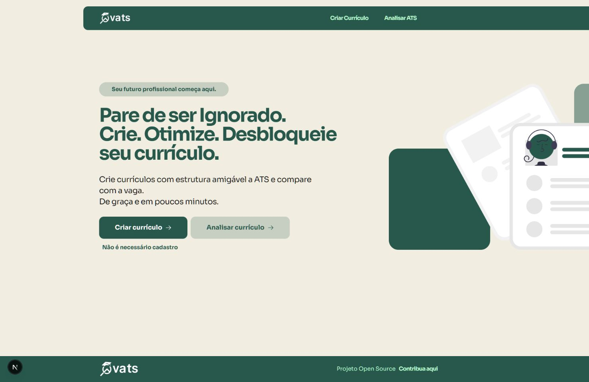

# cvats — ATS Resume Builder & Analyzer

[](https://github.com/rntxbr/cvats-app/actions/workflows/ci.yml)
[](LICENSE)
[](https://nextjs.org)
[](https://www.typescriptlang.org)

**Criador e analisador de currículos gratuito e de código aberto.** Monte um currículo com estrutura legível por sistemas ATS (Applicant Tracking Systems), exporte em PDF e compare seu conteúdo com uma vaga. Sem cadastro, com processamento dos currículos no navegador.

**Open-source ATS resume builder, PDF resume parser and resume analyzer.** Create a resume with three templates, preview the actual PDF and check job-description keywords. Resume files are processed locally in your browser. The interface is in Brazilian Portuguese.

[Acessar o cvats](https://cvats.com.br) · [Criar currículo](https://cvats.com.br/resume-builder) · [Analisar ATS](https://cvats.com.br/resume-parser) · [Reportar problema](https://github.com/rntxbr/cvats-app/issues)



## Recursos

- **3 modelos de currículo:** Clássico, Essencial e Executivo, com ajustes de aparência.
- **Prévia do PDF em tempo real:** o editor mostra o mesmo documento disponível para download, com páginas reais e zoom.
- **Exportação:** PDF com texto selecionável, TXT e backup editável em JSON.
- **Importação de PDF:** extração de contatos, experiências, empresas, períodos, formação e habilidades para preencher o editor.
- **Análise ATS:** critérios de estrutura e conteúdo, texto extraído e recomendações para revisão.
- **Comparação com vagas:** palavras-chave encontradas e ausentes, com lista editável.
- **Interface responsiva:** edição e visualização adaptadas a computadores e celulares.
- **Persistência local:** continue a edição no mesmo navegador, sem criar uma conta.

## Começar a usar

1. Abra o [editor](https://cvats.com.br/resume-builder) e preencha seus dados ou [importe um PDF](https://cvats.com.br/resume-import).
2. Escolha um modelo e confira as páginas na prévia.
3. Abra a avaliação ATS, revise as sugestões e baixe o currículo.
4. Para comparar um currículo existente com uma vaga, use o [analisador](https://cvats.com.br/resume-parser) com um PDF ou texto colado.

Revise os campos importados antes de exportar: a extração de PDF é heurística. PDFs de entrada devem ter até **10 MB e 30 páginas**, com texto selecionável. Não há OCR embutido; documentos digitalizados exigem OCR externo e arquivos protegidos precisam de uma cópia sem senha. A extração funciona melhor com uma coluna e títulos convencionais em português ou inglês, incluindo títulos compostos como “Formação Acadêmica e Idiomas”.

## Como funciona a avaliação ATS

A nota de estrutura e conteúdo soma critérios visíveis:

| Critério | Pontos |
| --- | ---: |
| Texto suficiente | 20 |
| E-mail | 10 |
| Telefone | 5 |
| Resumo ou objetivo | 10 |
| Experiência ou projetos | 15 |
| Formação | 10 |
| Habilidades | 10 |
| Períodos | 5 |
| Resultados concretos | 10 |
| Extensão | 5 |

A comparação com a vaga é uma nota separada: **termos encontrados / termos comparados**. Revise a lista automática ou informe palavras-chave separadas por vírgulas. A comparação ignora caixa e acentos, respeita limites de palavras e preserva termos como C++ e C#; não interpreta sinônimos, contexto, senioridade ou requisitos obrigatórios.

As notas ajudam a revisar o documento e não garantem aprovação em um ATS ou processo seletivo. O cvats não reproduz regras proprietárias de plataformas de recrutamento. Confira o conteúdo, o texto extraído e o PDF paginado antes de enviar.

## Desenvolvimento local

Pré-requisitos: **Node.js 22+** e **pnpm 10+**. O CI verifica Node.js 22 e 24.

```bash
git clone https://github.com/rntxbr/cvats-app.git
cd cvats-app
pnpm install
pnpm dev
```

Abra [localhost:3000](http://localhost:3000). Para contribuir, faça o clone do seu fork.

| Comando | Finalidade |
| --- | --- |
| `pnpm dev` | Servidor de desenvolvimento |
| `pnpm build` | Build de produção e saída standalone |
| `pnpm start` | Servidor de produção após o build |
| `pnpm lint` | Verificação com Biome |
| `pnpm typecheck` | Verificação de tipos |
| `pnpm test` | Testes do analisador, parser e persistência |
| `pnpm test:pdf` | Geração, extração e reimportação de PDFs nos três modelos |
| `pnpm check` | Tipos, lint, testes e verificação dos PDFs |

O worker do PDF.js é preparado em `postinstall`, `predev` e `prebuild`, a partir da versão instalada. Se instalar com scripts desabilitados, execute `node scripts/prepare-pdf-worker.mjs`. Os PDFs de teste ficam em `tmp/pdfs`, ignorado pelo Git.

## Tecnologias e estrutura

Next.js 16 (App Router), React 19, TypeScript, Tailwind CSS, Redux Toolkit, `@react-pdf/renderer`, PDF.js, Jest e Biome.

| Local | Responsabilidade |
| --- | --- |
| `app/resume-builder` | Editor e prévia do PDF |
| `app/resume-import` | Importação para o editor |
| `app/resume-parser` | Análise de PDF e comparação com a vaga |
| `app/lib/ats` | Critérios e pontuação ATS |
| `app/lib/parse-resume-from-pdf` | Extração e identificação dos campos |
| `app/lib/resume-headings.ts` | Reconhecimento compartilhado dos títulos das seções |
| `components` | Interface compartilhada |
| `scripts/verify-pdf.mjs` | Verificação da exportação e reimportação dos PDFs |

## Dados e analytics

Os PDFs e o conteúdo dos currículos são processados no navegador, sem upload para uma API. O editor salva os dados no armazenamento local, sob a chave `open-resume-state`. Em computadores compartilhados, eles permanecem acessíveis a quem usar o mesmo perfil. Exporte um backup em JSON antes de limpar os dados do navegador.

**Vercel Web Analytics** está integrado globalmente em `app/layout.tsx`, usando `@vercel/analytics/next`. Para registrar tráfego, habilite Web Analytics no painel do projeto Vercel, publique uma nova versão e visite o site. Não é necessário informar uma chave no código. Consulte o [guia oficial](https://vercel.com/docs/analytics/quickstart). A integração registra visitas e navegação; o código não envia o conteúdo dos currículos como eventos personalizados.

| Variável de build | Uso |
| --- | --- |
| `NEXT_PUBLIC_SITE_URL` | URL pública; padrão `https://cvats.com.br` |
| `NEXT_PUBLIC_GA_MEASUREMENT_ID` | Google Analytics opcional |
| `NEXT_PUBLIC_GOOGLE_SITE_VERIFICATION` | Verificação do site no Google |
| `NEXT_PUBLIC_YANDEX_VERIFICATION` | Verificação do site no Yandex |

## Produção

```bash
pnpm install --frozen-lockfile
pnpm build
pnpm start
```

Também é possível executar com Docker:

```bash
docker build -t cvats .
docker run --rm -p 3000:3000 cvats
```

O container usa Node.js 22, saída standalone e usuário sem privilégios. Configure as variáveis públicas no ambiente de build. Na Vercel, use o preset Next.js e mantenha o Web Analytics habilitado.

## Contribuir

Bugs, melhorias na extração de PDF, acessibilidade, documentação e novos testes são bem-vindos. Consulte o [guia de contribuição](CONTRIBUTING.md) e o [Código de Conduta](CODE_OF_CONDUCT.md).

1. Abra uma [issue](https://github.com/rntxbr/cvats-app/issues) com o problema ou proposta. Use exemplos fictícios ou anonimizados para currículos.
2. Faça um fork e crie uma branch a partir de `master`.
3. Implemente a alteração, execute `pnpm check` e `pnpm build`, e abra um PR explicando o resultado e a validação.

Use Conventional Commits, como `feat:`, `fix:` e `docs:`.

## Contribuidores

Obrigado a todas as pessoas que contribuem. Veja a [lista de contribuidores no GitHub](https://github.com/rntxbr/cvats-app/graphs/contributors).

<!-- ALL-CONTRIBUTORS-LIST:START - Do not remove or modify this section -->
<!-- prettier-ignore-start -->
<!-- markdownlint-disable -->
<table>
  <tbody>
    <tr>
      <td align="center" valign="top" width="14.28%"><a href="https://renatokhael.com/"><br /><sub><b>Renato Khael</b></sub></a><br /><a href="https://github.com/rntxbr/cvats/commits?author=rntxbr" title="Code">💻</a></td>
      <td align="center" valign="top" width="14.28%"><a href="https://github.com/CommitedBug"><br /><sub><b>Angelo Silva</b></sub></a><br /><a href="https://github.com/rntxbr/cvats/commits?author=CommitedBug" title="Code">💻</a></td>
      <td align="center" valign="top" width="14.28%"><a href="https://ruangustavo.com/"><br /><sub><b>Ruan Gustavo</b></sub></a><br /><a href="https://github.com/rntxbr/cvats/commits?author=ruangustavo" title="Code">💻</a></td>
      <td align="center" valign="top" width="14.28%"><a href="https://github.com/vitinh0z"><br /><sub><b>Victor Gabriel</b></sub></a><br /><a href="https://github.com/rntxbr/cvats/commits?author=vitinh0z" title="Code">💻</a></td>
    </tr>
  </tbody>
</table>

<!-- markdownlint-restore -->
<!-- prettier-ignore-end -->

<!-- ALL-CONTRIBUTORS-LIST:END -->

## Licença

[GNU Affero General Public License v3.0 (AGPL-3.0)](LICENSE).
